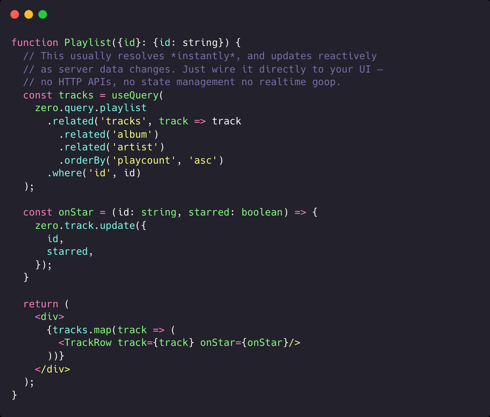

# Zero

Zero is a general-purpose sync engine for the web.

You put Zero in front of your database or web service, and we distribute your backend all the way to main thread of the UI. You get a client-side API that _looks_ like an embedded db, but to which you can issue arbitrary _hybrid queries_ that span the entire database, including the server.

Behind the scenes, we synchronize queries results continuously to a client-side persistent cache. This cache is used automatically for future queries whenever possible.

## More info

To learn more, see [zerosync.dev](https://zerosync.dev/).
